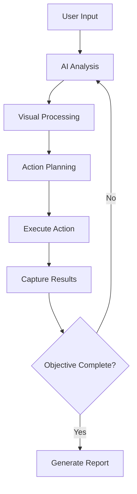

# 🤖 Mega Advanced AI Browser Agent

<div align="center">


**🚀 The Most Advanced AI-Powered Browser Automation Framework**

*Transform natural language into powerful web automation with 100+ intelligent features*

[🎯 Quick Start](#-quick-start) • [✨ Features](#-features) • [📖 Documentation](#-documentation) • [🤝 Contributing](#-contributing) • [💖 Support](#-support-this-project)

</div>

---

## 🌟 Why Choose This Agent?

🎯 **Natural Language Control** - Just tell it what you want: *"Go to Amazon, search for laptops, and compare the top 3 results"*

🧠 **AI-Powered Intelligence** - Uses Mistral AI to make smart decisions and adapt to any website

🎨 **Rich Visual Feedback** - See exactly what the agent is thinking with real-time UI overlays

🔐 **CAPTCHA Auto-Solving** - Automatically handles Cloudflare and other common CAPTCHAs

📊 **Comprehensive Analytics** - Detailed reports, performance metrics, and success tracking

🛡️ **Enterprise-Ready** - Robust error handling, retry mechanisms, and production-grade logging

---

## ✨ Features

**🎯 100+ Advanced Features for Professional Web Automation**

### 🧠 **AI-Powered Intelligence**
- 🎯 **Natural Language Processing** - Understands complex instructions in plain English
- 🤖 **Multi-LLM Support** - Mistral AI, OpenAI, Anthropic, Gemini compatibility
- 🔄 **Streaming Responses** - Real-time AI decision making with live feedback
- 📊 **Confidence Scoring** - AI provides confidence levels for each decision
- 🧩 **Context Awareness** - Remembers previous actions and adapts accordingly

### 🎨 **Visual & Interactive Features**
- 🖱️ **Human-like Cursor** - Realistic 8-step cursor animations
- 💬 **Live Chat Interface** - Modern AI chat bubbles with typing indicators
- 🏷️ **Smart Element Labeling** - Auto-annotated screenshots with numbered elements
- 📊 **Progress Indicators** - Professional progress rings and status displays
- 🎭 **AI Avatar System** - Visual AI representation with dynamic responses

### 🔐 **Advanced Automation**
- 🛡️ **CAPTCHA Auto-Solving** - Cloudflare, reCAPTCHA, and image CAPTCHAs
- 🌐 **Multi-Browser Support** - Parallel processing across multiple browser instances
- 📝 **Smart Form Filling** - AI-powered form detection and completion
- 🎮 **Macro Recording** - Record and replay complex automation sequences
- 🔄 **Retry Mechanisms** - Intelligent error recovery with exponential backoff

### 📊 **Analytics & Monitoring**
- 📈 **Performance Tracking** - Real-time metrics and optimization suggestions
- 📄 **HTML Reports** - Comprehensive session reports with visual analytics
- 🗄️ **SQLite Logging** - Complete action history with searchable database
- 📧 **Email Notifications** - Automated report delivery and alerts
- 📸 **Screenshot Gallery** - Visual audit trail of every action taken

### 🛠️ **Developer Features**
- 🚦 **Network Interception** - Monitor and modify HTTP requests/responses
- 📋 **Data Extraction** - Tables, emails, phone numbers, structured data
- 🔧 **JavaScript Execution** - Custom script injection and DOM manipulation
- 📱 **Multi-Tab Management** - Handle complex multi-window workflows
- ⚡ **Parallel Processing** - Execute multiple tasks simultaneously

---

## 🚀 How It Works

**🔄 Intelligent Automation Loop**



1. **🎯 Natural Language Input** - Describe your goal in plain English
2. **👁️ Visual Analysis** - AI captures and analyzes the current page state
3. **🏷️ Element Detection** - Identifies all interactive elements with smart labeling
4. **🧠 Decision Making** - AI determines the optimal next action with confidence scoring
5. **⚡ Action Execution** - Performs the action with human-like interactions
6. **📊 Results Logging** - Records everything for analytics and debugging

---

## 🎯 Quick Start

### **⚡ One-Line Installation**

```bash
git clone https://github.com/eres45/Agent.git && cd Agent && pip install -r requirements.txt
```

### **🔑 API Key Setup**

The agent will automatically prompt you for your Mistral AI API key on first run:

1. Visit [Mistral AI Console](https://console.mistral.ai/)
2. Create account and generate API key
3. Run the agent - it will guide you through setup!

### **🚀 Launch**

```bash
python agent.py
```

**That's it! The agent handles the rest automatically.**

---

## 📦 Detailed Installation

<details>
<summary>Click to expand detailed setup instructions</summary>

### **Prerequisites**
- Python 3.8+ 
- Google Chrome browser
- 4GB+ RAM recommended

### **Step-by-Step Setup**

#### **1. Clone Repository**
```bash
git clone https://github.com/eres45/Agent.git
cd Agent
```

#### **2. Virtual Environment**
```bash
# Windows
python -m venv .venv
.venv\Scripts\activate

# macOS/Linux  
python3 -m venv .venv
source .venv/bin/activate
```

#### **3. Install Dependencies**
```bash
pip install -r requirements.txt
```

#### **4. Environment Configuration**
Create `.env` file:

```env
# Required: Mistral AI API Key
MISTRAL_API_KEY="your-mistral-api-key-here"
API_KEY="your-mistral-api-key-here"
API_ENDPOINT_URL="https://api.mistral.ai/v1/chat/completions"
MODEL_NAME="mistral-large-latest"

# Optional: Email Reports
EMAIL_FROM="your-email@gmail.com"
EMAIL_USERNAME="your-email@gmail.com" 
EMAIL_PASSWORD="your-app-password"

# Optional: CAPTCHA Services
TWOCAPTCHA_API_KEY="your-2captcha-key"
ANTICAPTCHA_API_KEY="your-anticaptcha-key"
```

</details>

---

## 🎮 Usage Examples

### **🌟 Real-World Automation Tasks**

```bash
# E-commerce & Shopping
"Go to Amazon, search for wireless headphones under $100, and compare the top 3 results"

# Research & Information Gathering  
"Navigate to Wikipedia, search for 'Artificial Intelligence', and summarize the main article"

# Social Media & Content
"Open YouTube, find the latest video from MKBHD, and take notes on the key points"

# Development & GitHub
"Go to GitHub, find trending Python repositories, and star the most popular ones"

# Data Collection
"Visit Hacker News, extract the top 10 story titles and their URLs"
```

### **⚡ Interactive Commands**

| Command | Description | Example |
|---------|-------------|---------|
| `menu` | Show main menu | Interactive command palette |
| `info` | Page information | Current URL, title, elements |
| `screenshot` | Capture annotated screenshot | Visual page state |
| `history` | Recent actions log | Last 15 actions performed |
| `report` | Generate HTML report | Comprehensive session analytics |
| `stats` | Performance metrics | Success rates, timing data |
| `captcha` | Manual CAPTCHA solving | Force CAPTCHA detection |
| `extract` | Data extraction | Tables, emails, phone numbers |
| `record start/stop` | Macro recording | Save automation sequences |
| `monitor 30` | Performance monitoring | Track metrics for 30 seconds |
| `help` | Command reference | Full help documentation |
| `exit` | Shutdown agent | Generate final report |

---

## 📊 Performance & Analytics

### **📈 Built-in Metrics**
- **Success Rate Tracking** - Monitor automation reliability
- **Performance Scoring** - EXCELLENT/GOOD/FAIR ratings based on speed and accuracy
- **Action Analytics** - Detailed timing and success data for each interaction
- **Error Classification** - Categorized failure analysis with recovery suggestions

### **📄 Professional Reports**
- **HTML Dashboard** - Beautiful, interactive session reports
- **Screenshot Gallery** - Visual timeline of all actions taken  
- **Performance Charts** - Graphs showing trends and bottlenecks
- **Export Options** - CSV, JSON, and Excel format support

---

## 🛠️ Advanced Configuration

<details>
<summary>🔧 Advanced Settings & Customization</summary>

### **AI Model Configuration**
```env
# Switch between AI providers
MODEL_NAME="mistral-large-latest"          # Mistral AI (Recommended)
MODEL_NAME="gpt-4"                         # OpenAI GPT-4
MODEL_NAME="claude-3-opus-20240229"        # Anthropic Claude
MODEL_NAME="gemini-pro"                    # Google Gemini
```

### **Browser Settings**
```python
# Custom browser options in agent.py
chrome_options.add_argument("--window-size=1920,1080")
chrome_options.add_argument("--disable-blink-features=AutomationControlled")
chrome_options.add_experimental_option("useAutomationExtension", False)
```

### **Performance Tuning**
```env
# Adjust timing and retry settings
ACTION_DELAY=1.5                   # Seconds between actions
MAX_RETRIES=3                      # Retry attempts per action  
SCREENSHOT_QUALITY=85              # JPEG quality (1-100)
ELEMENT_HIGHLIGHT_DURATION=2.0     # Visual feedback timing
```

</details>

---

## 📁 Project Structure

```
Agent/
├── 📁 data/                    # SQLite databases & session data
├── 📁 downloads/               # Files downloaded by agent
├── 📁 exports/                 # Exported reports & data
├── 📁 logs/                    # Detailed error & debug logs
├── 📁 reports/                 # HTML session reports
├── 📁 screenshots/             # Action screenshots & gallery
├── 📁 temp/                    # Temporary processing files
├── 🔧 .env                     # Environment variables & API keys
├── 🐍 agent.py                 # Main application (3000+ lines)
├── 📋 requirements.txt         # Python dependencies
├── 🧪 test_mistral.py         # API key validation script
└── 📖 README.md               # This documentation
```

---

## 🤝 Contributing

We welcome contributions from the community! Here's how you can help make this project even better:

### **🚀 Ways to Contribute**
- 🐛 **Bug Reports** - Found an issue? Open a detailed bug report
- 💡 **Feature Requests** - Have an idea? We'd love to hear it
- 🔧 **Code Contributions** - Submit pull requests for improvements
- 📖 **Documentation** - Help improve our docs and examples
- 🧪 **Testing** - Test on different platforms and report compatibility

### **📋 Development Setup**
```bash
# Fork the repository
git fork https://github.com/eres45/Agent.git

# Clone your fork
git clone https://github.com/your-username/Agent.git
cd Agent

# Create feature branch
git checkout -b feature/your-feature-name

# Make changes and test
python agent.py

# Submit pull request
git push origin feature/your-feature-name
```

### **🎯 Contribution Guidelines**
- Follow existing code style and patterns
- Add tests for new features
- Update documentation for changes
- Keep commits focused and descriptive
- Test across different operating systems

---

## 💖 Support This Project

If you find this project helpful, please consider supporting it:

### **⭐ Star the Repository**
**Give us a star on GitHub!** It helps others discover this project and motivates continued development.

[](https://github.com/eres45/Agent/stargazers)

### **💰 Sponsor Development**
Support ongoing development and new features:

[](https://github.com/sponsors/eres45)
[](https://buymeacoffee.com/eres)
[](https://paypal.me/eres45)

### **🌟 Other Ways to Help**
- 📢 **Share** the project with others who might find it useful
- 🐦 **Tweet** about your experience using the agent
- 📝 **Write** a blog post or tutorial
- 🎥 **Create** video demonstrations
- 💬 **Join** our community discussions

---

## 📄 License

This project is licensed under the **MIT License** - see the [LICENSE](LICENSE) file for details.

```
MIT License

Copyright (c) 2025 eres

Permission is hereby granted, free of charge, to any person obtaining a copy
of this software and associated documentation files (the "Software"), to deal
in the Software without restriction, including without limitation the rights
to use, copy, modify, merge, publish, distribute, sublicense, and/or sell
copies of the Software, and to permit persons to whom the Software is
furnished to do so, subject to the following conditions:

The above copyright notice and this permission notice shall be included in all
copies or substantial portions of the Software.
```

---

## 🔗 Links & Resources

### **📚 Documentation**
- [API Reference](docs/api.md) - Complete API documentation
- [Configuration Guide](docs/config.md) - Advanced configuration options
- [Troubleshooting](docs/troubleshooting.md) - Common issues and solutions
- [Examples Gallery](docs/examples.md) - Real-world automation examples

### **🌐 Community**
- [GitHub Discussions](https://github.com/eres45/Agent/discussions) - Community Q&A
- [Discord Server](https://discord.gg/agent-community) - Real-time chat
- [Reddit Community](https://reddit.com/r/AIBrowserAgent) - Share experiences
- [Stack Overflow](https://stackoverflow.com/questions/tagged/ai-browser-agent) - Technical questions

### **📊 Project Stats**
- 
- 
- 
- 
- 

---

## 🙏 Acknowledgments

Special thanks to:
- **Mistral AI** for providing the powerful language model
- **Selenium** team for the robust browser automation framework
- **Open Source Community** for inspiration and contributions
- **Beta Testers** who helped identify and fix issues
- **Contributors** who made this project better

---

<div align="center">

**🤖 Built with ❤️ by [eres](https://github.com/eres45)**

*Transform your web automation with AI-powered intelligence*

[⭐ Star](https://github.com/eres45/Agent) • [🐛 Issues](https://github.com/eres45/Agent/issues) • [💡 Discussions](https://github.com/eres45/Agent/discussions) • [💖 Sponsor](https://github.com/sponsors/eres45)

</div>
